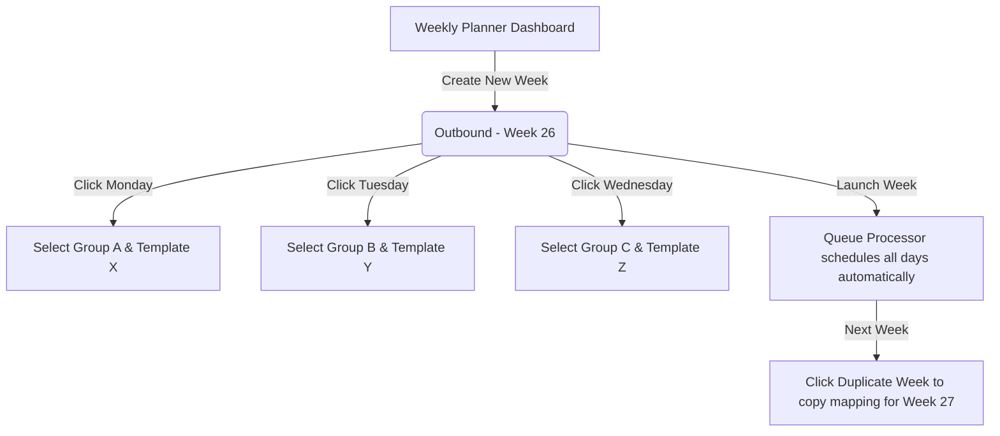

# Analysis of Weekly Daily-Targeting Outbound Mailing Workflow

This document reviews the outbound mailing system's current architecture against the sales team's core workflow: **scheduling targeted emails day-by-day (Monday to Sunday) using specific templates for specific groups of companies, with follow-ups and weekly template iterations.**

---

## 1. Core Workflow Mismatch

In the current implementation:
* A **Campaign** is a single long-running entity tied to **one Template** and a flat list of recipients.
* The system schedules all recipients sequentially using a single time-gap algorithm, distributing them across all selected active days.
* There is no built-in way to say: *"Send Template A to Group X on Monday, Template B to Group Y on Tuesday, and Template C to Group Z on Wednesday"* within a single campaign.

### The Current Friction:
To execute this workflow today, the sales team must create **seven separate campaigns every single week**. For each campaign, they must go through the 6-step wizard:
1. Define Campaign Basics (Name, Description).
2. Select the daily template and SMTP config.
3. Manually pick the target contact group.
4. Upload attachments.
5. Set the specific start date and time for that day.
6. Launch it.

This process is repetitive, error-prone, and adds excessive administrative overhead.

---

## 2. Redundant / "Useless" Features in Current Approach

Under the sales team's daily-targeting workflow, several existing design elements are inefficient or redundant:

### ❌ Flat, Continuous Campaign Scheduling
The current scheduling logic (`calculateSendTimes` in [scheduler.ts](file:///e:/Work%20Files/crm-softwares/mailing-system/lib/mailer/scheduler.ts)) assumes a single template is sent to a large pool of contacts over several days. Spreading a single list over multiple days without day-specific template logic is useless to a team that needs daily context-specific targeting.

### ❌ Static Campaign-level "Active Days"
Currently, selecting active days (e.g., `['Monday', 'Wednesday']`) on a campaign simply restricts when the queue processes *any* contact in the list. It does not map specific contact subgroups to specific days, making it impossible to manage weekly daily schedules under a single campaign.

### ❌ Multi-Step Campaign Wizard for Daily Sends
Running a 6-step wizard seven times a week is tedious. The wizard is designed for large, isolated campaigns, not quick, daily schedules.

---

## 3. Required Features (To Be Added)

To support a smooth, daily-targeting workflow, we need to introduce the following:

### 1. Weekly Plan & Daily Schedule Abstraction
We should introduce a **Weekly Planner** system. Instead of individual daily campaigns, the sales team sets up a "Weekly Plan" (e.g., *Week 26 Outbound*). Inside this weekly plan, they define daily slots (Monday to Sunday):
* **Monday**: Group A + Template X
* **Tuesday**: Group B + Template Y
* **Wednesday**: Group C + Template Z
* *And so on...*

### 2. Unified Weekly Calendar / Planner UI
A dashboard view representing a calendar week (Monday to Sunday). Users can:
* See what is scheduled for each day at a glance.
* Click **Add Group** on any day, assign a template, and configure the sending time/gap.
* Easily toggle/view what templates are active for the week.

### 3. Template Versioning & Quick Cloning
Since content changes week-to-week (*"next week the content might change, so we might have a different template or edit the similar one"*), the system should offer:
* **One-Click Template Duplicate**: Copy an existing template (e.g., "Intro ESD V1" $\rightarrow$ "Intro ESD V2") to quickly modify it for the next week.
* **Campaign-Specific Overrides**: Allow editing the template content *directly* inside a weekly plan without overwriting the global template.

### 4. Schedule Roll-Over / Duplication
At the end of a week, a **"Duplicate Week"** button should let the team copy the entire mapping of Groups and settings into the next week as a draft, so they only need to update the templates rather than rebuilding the daily schedules.

---

## 4. Proposed Database Updates

To implement this plan cleanly without breaking the existing core campaign architecture, we can introduce two tables: `weekly_plans` and `daily_schedules`.

```sql
-- Represents a 7-day outbound plan
CREATE TABLE weekly_plans (
  id            UUID PRIMARY KEY DEFAULT gen_random_uuid(),
  name          TEXT NOT NULL,                      -- e.g., "Outbound Plan - Week 26"
  start_date    DATE NOT NULL,                      -- Monday date of the week
  status        TEXT DEFAULT 'draft' CHECK (status IN ('draft', 'active', 'completed')),
  created_at    TIMESTAMPTZ DEFAULT now(),
  updated_at    TIMESTAMPTZ DEFAULT now()
);

-- Represents the schedule and config for a specific day in a weekly plan
CREATE TABLE daily_schedules (
  id                UUID PRIMARY KEY DEFAULT gen_random_uuid(),
  weekly_plan_id    UUID REFERENCES weekly_plans(id) ON DELETE CASCADE,
  day_of_week       TEXT NOT NULL CHECK (day_of_week IN ('Monday', 'Tuesday', 'Wednesday', 'Thursday', 'Friday', 'Saturday', 'Sunday')),
  group_id          UUID REFERENCES contact_groups(id) ON DELETE SET NULL,
  template_id       UUID REFERENCES email_templates(id) ON DELETE SET NULL,
  smtp_config_id    UUID REFERENCES smtp_configs(id) ON DELETE SET NULL,
  send_time         TIME DEFAULT '09:00:00',
  send_gap_minutes  INTEGER DEFAULT 15,
  gap_jitter_pct    INTEGER DEFAULT 20,
  created_at        TIMESTAMPTZ DEFAULT now(),
  updated_at        TIMESTAMPTZ DEFAULT now(),
  UNIQUE (weekly_plan_id, day_of_week)
);
```

### How the Scheduler Logic Adapts:
1. When a weekly plan is activated (set to `active`), the backend iterates over the `daily_schedules`.
2. For each day, it fetches the contacts in the selected `group_id`.
3. It resolves the specific date for that `day_of_week` based on `weekly_plan.start_date`.
4. It schedules all group contacts sequentially starting from `send_time` on that date, using `send_gap_minutes` and `gap_jitter_pct`.
5. It inserts them into the existing `campaign_recipients` or a modified version of it, keeping the processing logic (`app/api/send/process/route.ts`) intact.

---

## 5. Suggested User Experience (UI Flow)



### Calendar View Concept
A simplified weekly view where each card represents a day:
* **Monday**: `[Group: EMS Tier 2]` $\rightarrow$ `[Template: Intro ESD Consumables]`
* **Tuesday**: `[Group: PCB Assemblers Pune]` $\rightarrow$ `[Template: Special Packaging Promo]`
* **Wednesday**: *Empty (Click to schedule)*

This centralizes all campaign scheduling in one place, removing the need for the sales team to navigate multiple separate campaign details.
